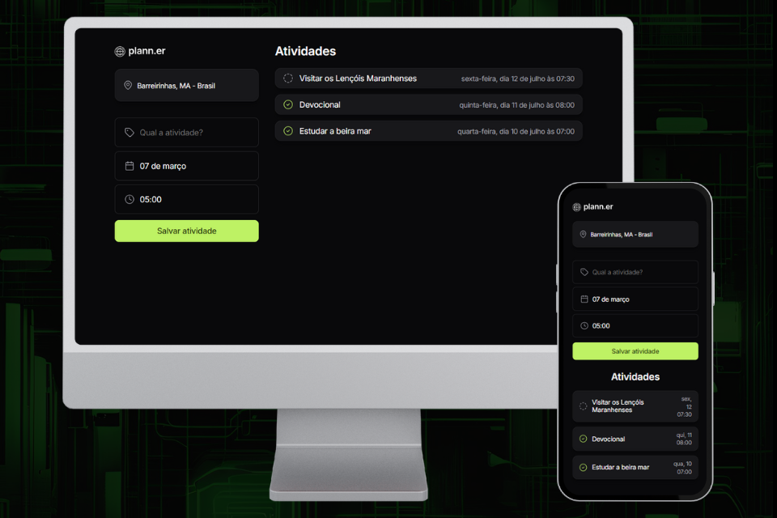

   

### Deploy --> <a href="https://brunacostaz.github.io/plann.er/" text-align="center">plann.er</a>

O plann.er é um planejador de viagens para organizar e acompanhar todas as informações e programações para cada destino, facilitando o acesso rápido para as pessoas e tornando o processo divertido e intuitivo. 

Esse projeto foi proposto pelo evento NLW (Next Level Week) Journay, promovido pela Rocketseat, composto por 10 trilhas de aprendizado em programação. A trilha que eu escolhi foi a de HTML, CSS e JavaScript, para aprofundar e consolidar os meus conhecimentos em CSS e JS. Nessa trilha, desenvolvi a parte destinada a organizar as atividades que o usuário fará em sua viagem. 

## 🔨 Funcionalidades do projeto

- Cadastro das atividades: o usuário pode cadastrar quais atividades deseja realizar em sua viagem, colocando o nome, data e horário que pretende fazê-la
- Validação de data e hora antes do cadastro: o sistema não permite que o usuário cadastre atividades na mesma data e hora, pois entende-se que só é possível realizar um item por vez
- Acompanhando do status: o usuário pode acompanhar o status da atividade, ou seja, se foi ou não realizada. Para isso, cada item possui um checkbox
- Responsividade para diferentes dispositivos: através do media query, o projeto possui responsividade para dispositivos móveis e desktop

## 🚀 Tecnologias utilizadas

- `HTML e CSS`
- `JavaScript`
- `Day.js` --> (biblioteca para manipular a formatação das datas)
- `Git e GitHub`

## 💡 Experiência Adquirida

- Aprimorei os meus conhecimentos de JS, trabalhando com array, objetos, funções e arrow function. 
- Manipulei a estilização dos elementos para diferentes dispositivos, através do media query.
- Desenvolvi mudanças dinâmicas no HTML e CSS diretamente pelo JavaScript 
- Adicionei alguns detalhes extras, em relação ao projeto padrão, como a logo, favicon, hover para o botão e cursor pointer para melhorar a usabilidade.

## 🎯 Considerações Finais

O plann.er foi desenvolvido para transmitir uma boa experiência de usuário, pois cada detalhe como animações, transições, sombras e disposição dos elementos foram estrategicamentes pensadas para garantir uma boa usabilidade e fluidez na aplicação.

